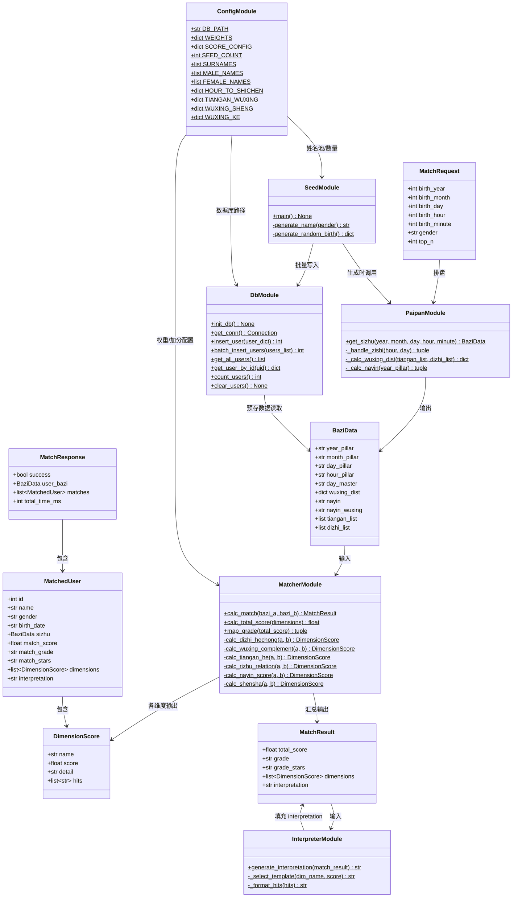
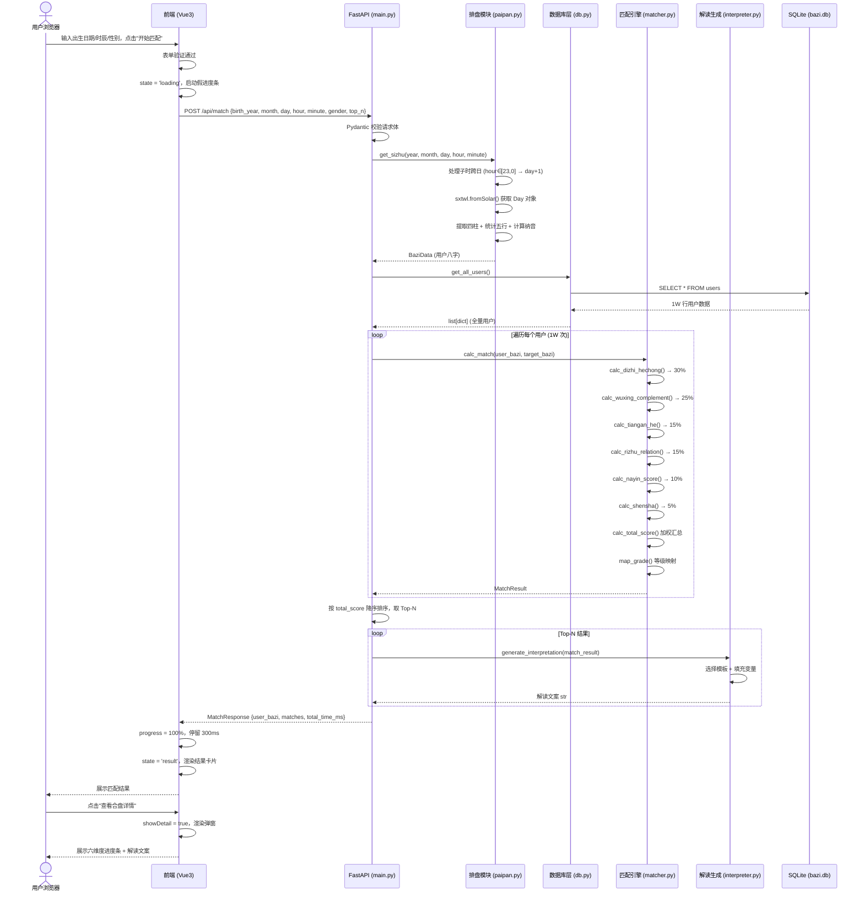
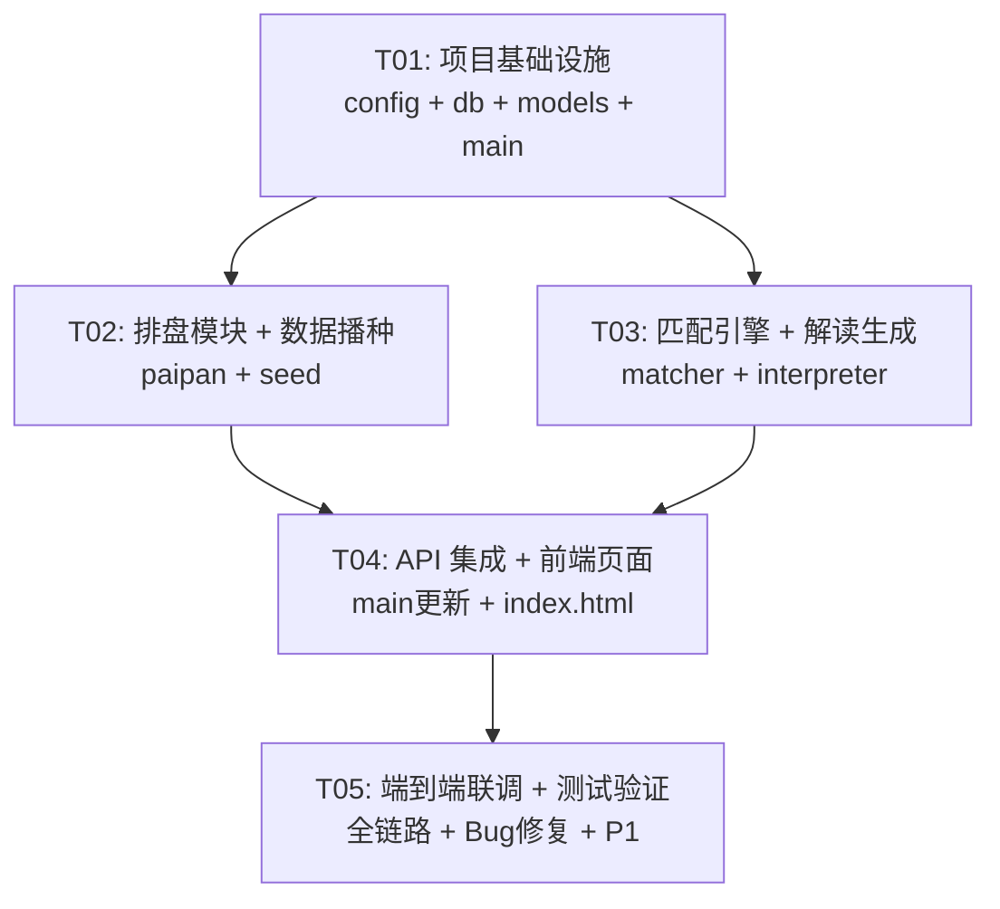

# 八字合盘匹配系统 — 系统架构设计

> 版本：v1.0 | 日期：2026-06-05 | 作者：高见远（架构师）

---

## Part A：系统设计

### 1. 实现方案与框架选型

#### 1.1 核心技术挑战

| 挑战 | 难度 | 应对策略 |
|------|------|---------|
| sxtwl 排盘边界处理（子时跨日、立春分界） | 高 | 封装 paipan 模块统一处理，编写边界用例覆盖 23:00-01:00 和立春前后 |
| 1W 用户全量遍历匹配性能 < 3s | 中 | 预计算八字存 SQLite，匹配时只做查表+算分；若超时则粗筛精排 |
| 六维度打分算法正确性 | 中 | 每维度独立函数+独立测试，用已知八字案例反向验证 |
| 前端三状态切换+弹窗交互 | 低 | Vue3 响应式驱动，v-if 条件渲染 |

#### 1.2 框架选型与理由

| 层 | 选型 | 版本 | 选型理由 |
|---|------|------|---------|
| **后端框架** | FastAPI | >=0.104 | 异步高性能，自动 OpenAPI 文档，Pydantic 数据校验内置 |
| **八字排盘** | sxtwl（寿星天文历） | >=2.0 | 唯一能精确处理立春/节气/子时的 Python 八字库 |
| **数据库** | SQLite 3 | Python 内置 | 1W 条零配置，单文件部署，无需 DBA |
| **数据校验** | Pydantic v2 | >=2.0 | FastAPI 内置，请求/响应自动校验序列化 |
| **ASGI 服务** | uvicorn | >=0.24 | 生产级 ASGI 服务器，支持热重载 |
| **前端框架** | Vue 3 | CDN 最新 | 响应式+组件化，无需构建工具，CDN 引入即可 |
| **前端样式** | Tailwind CSS | CDN 最新 | 实用优先，快速出效果，CDN 引入无需 PostCSS |
| **HTTP 客户端** | axios | CDN 最新 | 轻量 Promise API，拦截器支持错误处理 |

#### 1.3 整体架构

```
┌─────────────────────────────────────────────────────┐
│                   浏览器（用户）                      │
│   Vue3 单页应用（index.html）                        │
│   状态机：input → loading → result + 弹窗            │
└─────────────────┬─────────────────────────────────┘
                  │ HTTP (axios)
                  │ POST /api/match | GET /api/health
                  ▼
┌─────────────────────────────────────────────────────┐
│              FastAPI 后端服务（:8000）                │
│                                                     │
│  ┌──────────┐  ┌──────────┐  ┌──────────────┐   │
│  │ 排盘模块  │  │ 匹配引擎  │  │  解读生成     │   │
│  │ paipan   │  │ matcher  │  │  interpreter  │   │
│  │ (sxtwl)  │  │ (六维度)  │  │  (模板拼接)   │   │
│  └────┬─────┘  └────┬─────┘  └──────┬───────┘   │
│       │              │               │            │
│       └──────────────┼───────────────┘            │
│                      ▼                            │
│       ┌──────────────────────────────────┐        │
│       │    db.py 数据访问层               │        │
│       │    SQLite (data/bazi.db)         │        │
│       │    users 表（1W 虚拟用户预计算）   │        │
│       └──────────────────────────────────┘        │
└─────────────────────────────────────────────────────┘
```

**架构模式**：三层架构（API 层 → 业务逻辑层 → 数据访问层），无状态服务，单机部署。

---

### 2. 文件列表

```
bazi-match/
├── docs/                          # 设计文档（已有）
│   ├── 00-项目总览.md
│   ├── 01-后端技术方案.md
│   ├── 02-前端技术方案.md
│   ├── 03-数据库设计.md
│   ├── 04-合盘算法详细设计.md
│   └── ARCHITECTURE.md            # 本文件
│
├── backend/
│   ├── main.py                    # FastAPI 入口，路由注册，CORS，异常处理
│   ├── config.py                   # 全局配置（权重、数据库路径、姓名池等）
│   ├── models.py                   # Pydantic 请求/响应模型
│   ├── paipan.py                   # 排盘模块（sxtwl 封装）
│   ├── matcher.py                  # 匹配引擎（六维度打分 + 汇总 + 等级映射）
│   ├── interpreter.py             # 解读生成（模板化文案拼接）
│   ├── db.py                      # 数据库操作层（SQLite CRUD）
│   ├── seed.py                     # 虚拟用户数据生成脚本
│   ├── requirements.txt           # Python 依赖
│   └── tests/
│       ├── conftest.py            # pytest 公共 fixture（mock BaziData）
│       ├── test_paipan.py         # 排盘模块测试
│       ├── test_matcher.py        # 匹配引擎测试
│       ├── test_db.py             # 数据库操作测试
│       └── test_api.py            # API 端到端测试
│
├── frontend/
│   └── index.html                 # 单页应用（Vue3 + Tailwind + axios）
│
├── data/
│   └── bazi.db                    # SQLite 数据库文件（.gitignore）
│
├── .gitignore                     # 忽略 data/*.db、__pycache__ 等
└── README.md                      # 项目说明
```

---

### 3. 数据结构与接口（类图）



#### API 接口定义

| 方法 | 路径 | 请求体 | 响应体 | 说明 |
|------|------|--------|--------|------|
| POST | `/api/match` | `MatchRequest` | `MatchResponse` | 核心匹配接口 |
| GET | `/api/health` | — | `{"status": "ok"}` | 健康检查 |

**POST /api/match 完整流程**：
1. 接收 `MatchRequest`，Pydantic 自动校验
2. 调用 `paipan.get_sizhu()` 计算当前用户八字 → `BaziData`
3. 调用 `db.get_all_users()` 获取全量用户
4. 遍历每个用户：从预存字段构建 `BaziData` → 调用 `matcher.calc_match()` → 得到 `MatchResult`
5. 按 `total_score` 降序排序，取 Top-N
6. 对每条调用 `interpreter.generate_interpretation()` 生成解读
7. 组装 `MatchResponse` 返回

---

### 4. 程序调用流程（时序图）

#### 4.1 核心匹配流程



#### 4.2 数据播种流程

```mermaid
sequenceDiagram
    participant Script as seed.py
    participant PP as 排盘模块 (paipan.py)
    participant DB as 数据库层 (db.py)
    participant SQLite as SQLite (bazi.db)

    Script->>DB: count_users()
    DB->>SQLite: SELECT COUNT(*) FROM users
    SQLite-->>DB: 当前条数
    DB-->>Script: count

    alt count > 0
        Script->>Script: 确认是否清空后重新生成
        Script->>DB: clear_users()
        DB->>SQLite: DELETE FROM users
    end

    Script->>DB: init_db()
    DB->>SQLite: CREATE TABLE IF NOT EXISTS...

    loop 1W 次 (每 500 条一批)
        Script->>Script: 生成随机姓名 + 出生日期
        Script->>PP: get_sizhu(year, month, day, hour, minute)
        PP-->>Script: BaziData
        Script->>Script: 组装 user_dict
    end

    Script->>DB: batch_insert_users(users_batch)
    DB->>SQLite: INSERT INTO users ... (事务)
    SQLite-->>DB: OK
end

    Script->>DB: count_users()
    DB-->>Script: 10000 ✅
```

---

### 5. 待明确事项

| # | 问题 | 假设/建议 | 影响范围 |
|---|------|----------|---------|
| 1 | 匹配是否排除自身（出生日期与虚拟用户相同） | MVP 不排除，算法无此逻辑 | matcher.py |
| 2 | 性别筛选是否 Phase 1 加入 | MVP 不加，Phase 2 加 gender_filter 参数 | API、db.py |
| 3 | 1W 虚拟用户性别比例 | 50/50 随机 | seed.py |
| 4 | Top-N 默认值 | 默认 5，范围 1-20 | models.py、前端 |
| 5 | 免责声明是否需用户勾选 | 仅展示，不需勾选 | 前端 |
| 6 | 权重外部化后是否需管理界面 | 仅 config.py 修改，无管理界面 | config.py |
| 7 | 分享功能形态（截图/短链接） | Phase 3 再定，不影响 MVP | — |
| 8 | sxtwl 立春精确时刻的处理 | 以 sxtwl 库输出为准，不做人工校验 | paipan.py |
| 9 | seed.py 重复运行的幂等策略 | 有数据时提示确认后清空重建 | seed.py |
| 10 | 匹配计算超 3s 时的降级策略 | 先实现，超时再考虑粗筛精排优化 | matcher.py |

---

## Part B：任务分解

### 6. 依赖包列表

#### Python 后端（requirements.txt）

```
fastapi>=0.104.0       # Web 框架
uvicorn>=0.24.0        # ASGI 服务器
sxtwl>=2.0.0           # 寿星天文历排盘
pydantic>=2.0.0        # 数据校验（FastAPI 内置，显式声明版本）
pytest>=7.4.0          # 测试框架
httpx>=0.25.0          # 异步 HTTP 客户端（测试 TestClient 用）
```

#### 前端 CDN（index.html 内引用）

```html
<script src="https://unpkg.com/vue@3"></script>
<script src="https://cdn.tailwindcss.com"></script>
<script src="https://cdn.jsdelivr.net/npm/axios"></script>
```

---

### 7. 任务列表

> 遵循硬性约束：最大 5 个任务，按功能模块/层次分组，首任务为项目基础设施。

---

#### T01：项目基础设施（配置 + 数据层 + 入口）

**目标**：搭建项目骨架，完成数据库建表、数据访问层、配置文件、FastAPI 入口及健康检查。

| 子项 | 说明 |
|------|------|
| config.py | 全局配置：DB_PATH、WEIGHTS、SCORE_CONFIG、姓名池、天干地支映射表、五行生克关系表、纳音对照表、时辰映射 |
| db.py | 数据库操作层：init_db()、get_conn()、insert_user()、batch_insert_users()、get_all_users()、get_user_by_id()、count_users()、clear_users() |
| models.py | Pydantic 模型：BaziData、DimensionScore、MatchResult、MatchRequest、MatchedUser、MatchResponse |
| main.py | FastAPI 入口：app 创建、CORS 中间件、GET /api/health、全局异常处理、启动时 init_db() |
| requirements.txt | Python 依赖声明 |
| .gitignore | 忽略 data/*.db、__pycache__、.env |
| tests/conftest.py | pytest 公共 fixture（mock BaziData 工厂函数） |
| tests/test_db.py | 数据库操作测试 |

**源文件**：`backend/config.py`, `backend/db.py`, `backend/models.py`, `backend/main.py`, `backend/requirements.txt`, `.gitignore`, `backend/tests/conftest.py`, `backend/tests/test_db.py`

**依赖**：无（首个任务）

**优先级**：P0

---

#### T02：排盘模块 + 数据播种

**目标**：实现 sxtwl 排盘封装（含子时跨日、立春边界处理）和 1W 虚拟用户数据生成脚本。

| 子项 | 说明 |
|------|------|
| paipan.py | 排盘模块：get_sizhu()、子时跨日处理、四柱提取、五行统计、纳音计算、天干地支映射常量 |
| seed.py | 数据播种：随机姓名/生日生成、调用 paipan 预计算八字、批量写入 DB、幂等检查、进度条 |
| tests/test_paipan.py | 排盘测试：普通日期、子时(23:00/00:00)、立春前后、节气边界、已知八字案例验证 |

**源文件**：`backend/paipan.py`, `backend/seed.py`, `backend/tests/test_paipan.py`

**依赖**：T01

**优先级**：P0

---

#### T03：匹配引擎 + 解读生成

**目标**：实现六维度打分算法、加权汇总、等级映射和模板化解读文案生成。

| 子项 | 说明 |
|------|------|
| matcher.py | 匹配引擎：calc_dizhi_hechong()、calc_wuxing_complement()、calc_tiangan_he()、calc_rizhu_relation()、calc_nayin_score()、calc_shensha()、calc_total_score()、map_grade()、calc_match() 主入口 |
| interpreter.py | 解读生成：各维度高/中/低模板文案、总评等级文案、通用建议文案、generate_interpretation()、format_hits() |
| tests/test_matcher.py | 匹配引擎测试：各维度独立测试（六合/六冲/三合、五行互补、天干五合、日主生克、纳音、神煞）、总分汇总、等级映射、边界案例 |
| 更新 config.py | 补充 SCORE_CONFIG（加减分幅度）和解读模板常量（或 interpreter.py 内定义） |

**源文件**：`backend/matcher.py`, `backend/interpreter.py`, `backend/tests/test_matcher.py`, `backend/config.py`（更新）

**依赖**：T01

**优先级**：P0

---

#### T04：API 集成 + 前端页面

**目标**：完成 POST /api/match 端点实现、前端单页应用（输入表单 + 加载动画 + 结果展示 + 合盘详情弹窗）。

| 子项 | 说明 |
|------|------|
| 更新 main.py | 实现 POST /api/match：排盘 → 全量读取 → 遍历打分 → 排序 Top-N → 解读生成 → 组装响应；性能计时 |
| frontend/index.html | Vue3 单页应用：三状态切换（input/loading/result）、输入表单（日期+时辰+性别+数量）、表单验证、假进度条加载动画、结果卡片列表（八字信息+匹配列表+星级+等级）、合盘详情弹窗（六维度进度条+解读文案）、重新匹配按钮、免责声明、错误处理（HTTP 4xx/5xx/超时）、ESC/遮罩关闭弹窗、弹窗打开禁止背景滚动、Tailwind 样式（indigo-600 主色调） |
| tests/test_api.py | API 端到端测试：健康检查、正常匹配请求、参数校验、异常处理 |

**源文件**：`backend/main.py`（更新）, `frontend/index.html`, `backend/tests/test_api.py`

**依赖**：T01, T02, T03

**优先级**：P0

---

#### T05：端到端联调 + 测试验证

**目标**：全链路联调、性能验证、Bug 修复、最终交付。

| 子项 | 说明 |
|------|------|
| 运行 seed.py | 生成 1W 虚拟用户数据，验证 count = 10000 |
| 启动后端 | uvicorn main:app，验证 /docs Swagger 正常 |
| 前端联调 | 打开 index.html，输入表单 → 匹配 → 结果展示 → 详情弹窗全流程 |
| 性能测试 | 单次 /api/match 响应 < 3s，若超时分析瓶颈 |
| 抽样验证 | 随机 10 条虚拟用户八字，手动验证排盘正确性 |
| 全量 pytest | 运行所有测试通过 |
| 修复 Bug | 联调中发现的问题 |
| 五行生克加成 | 实现 P1-21：五行互补维度的间接互补加分逻辑 |
| 权重外部化确认 | 确认 config.py 中 WEIGHTS/SCORE_CONFIG 可修改生效（P1-22） |

**源文件**：所有文件（联调修改）

**依赖**：T01, T02, T03, T04

**优先级**：P0 + P1

---

### 8. 共享知识（跨文件约定）

```
- API 响应格式：MatchResponse，success=true/false + data + total_time_ms
- 所有日期时间：阳历（公历），前端输入 date 类型自动返回 YYYY-MM-DD
- 性别字段：固定 "男"/"女" 两个值，不用 M/F
- 五行顺序：金、木、水、火、土（所有迭代保持一致）
- 八字四柱顺序：年柱、月柱、日柱、时柱
- 天干地支用中文单字："甲乙丙丁戊己庚辛壬癸"、"子丑寅卯辰巳午未申酉戌亥"
- SQLite 中 JSON 字段（wuxing_dist、tian_nos、di_zhis）存储为 TEXT，读取时 json.loads()
- 匹配算法权重从 config.WEIGHTS 读取，不硬编码
- 各维度打分范围 0-100，钳制（clamp）输出
- 总分保留 1 位小数（round(x, 1)）
- 等级映射阈值：85/70/55/40
- 数据库路径：data/bazi.db（相对项目根目录）
- CORS：允许所有来源（开发阶段），生产环境需限制
- 前端 axios 超时：10000ms
- 假进度条：setInterval 30ms，0→90%，后端返回后跳 100%
- 错误处理：后端用 FastAPI HTTPException，前端 try/catch + 用户友好提示
- 纳音对照表：60 甲子 → 30 种纳音，存于 config.py
- 排盘子时处理：hour=23 或 hour=0 时日期+1，用次日日柱
- 测试框架：pytest，fixture 放 conftest.py
```

---

### 9. 任务依赖图



**说明**：
- T01 是基础，所有任务依赖它
- T02（排盘+播种）和 T03（匹配+解读）可并行开发
- T04 需要 T02 + T03 完成后才能联调
- T05 是最终集成验证
