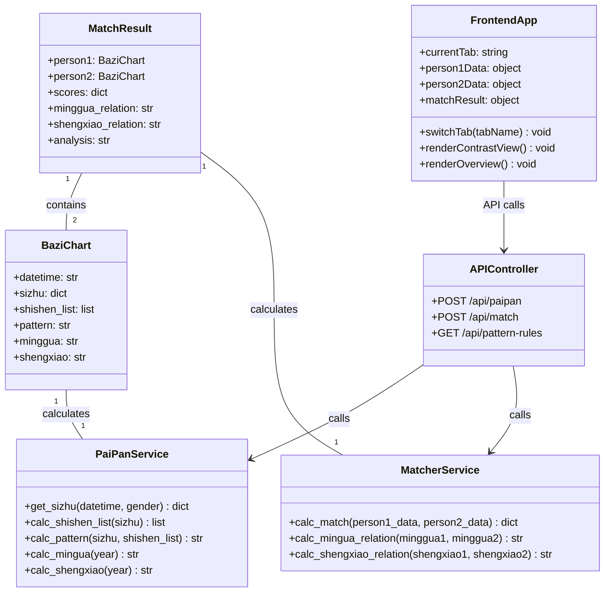
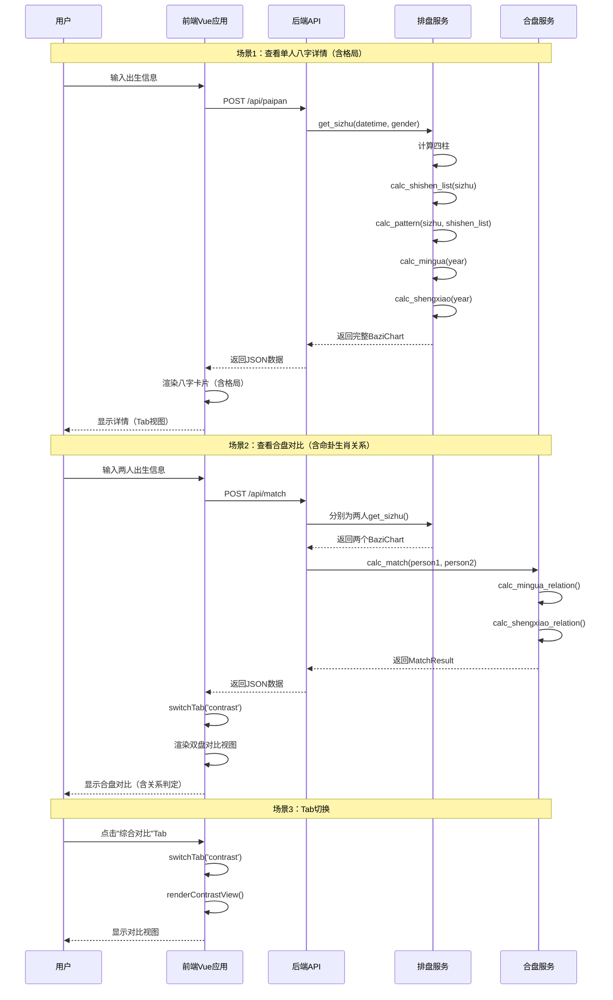
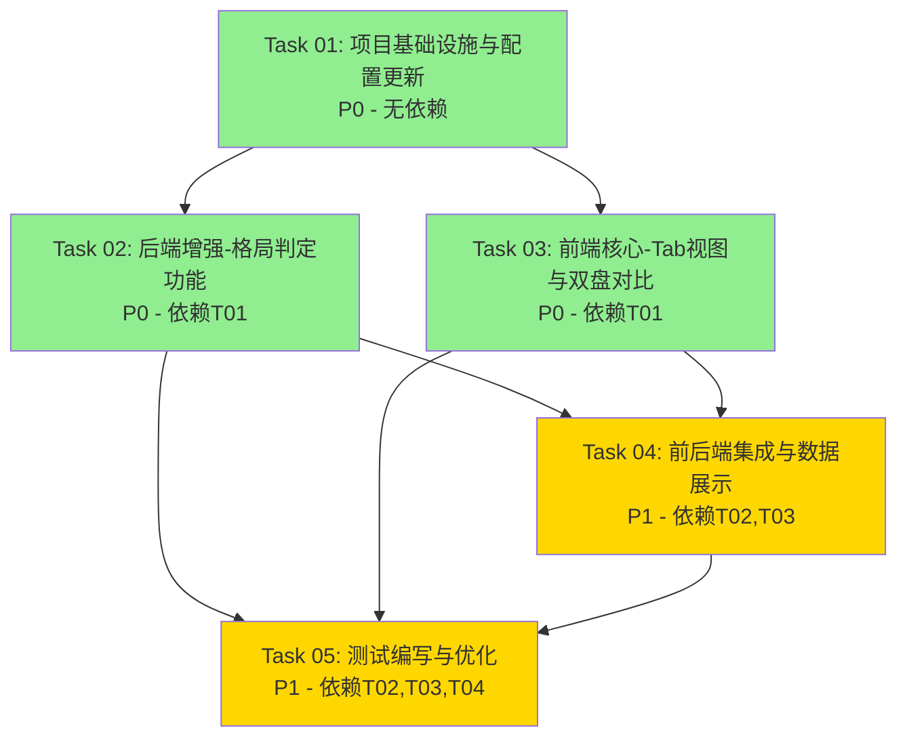

# 八字合盘详情页改造 - 系统设计与任务分解

## Part A: System Design

### 1. Implementation Approach

#### Core Technical Challenges

1. **前端视图改造**：需要将现有的单视图详情页改造为多Tab视图，涉及Vue组件重构和状态管理
2. **格局判定算法**：需要基于传统八字理论实现格局判定逻辑（如正官格、七杀格等）
3. **双盘对比展示**：需要实现双人八字数据的并排对比和关系计算
4. **数据完整性**：确保后端API返回所有前端需要的数据字段

#### Framework and Library Selections

**后端（已有）：**
- Python + FastAPI：轻量级Web框架，已有main.py
- 数据结构：Pydantic models（已有models.py）

**前端（已有）：**
- Vue 3：渐进式JavaScript框架（已有Vue状态管理）
- Tailwind CSS：实用优先的CSS框架（已有style.css）
- 原生JavaScript：用于八字排盘计算（已有paipan.py）

#### Architecture Patterns

采用**前后端分离架构**：
- 后端：MVC模式（Model-View-Controller）
  - Model: models.py（数据模型）
  - Controller: main.py（API路由）
  - Service: paipan.py, matcher.py（业务逻辑）
- 前端：组件化架构
  - 视图层：Vue组件（Tab视图、八字卡片、对比表格）
  - 状态管理：Vue reactive data
  - API调用：Axios/Fetch

### 2. File List

```
backend/
├── main.py              # FastAPI应用入口（需修改：添加pattern字段）
├── models.py            # Pydantic数据模型（需修改：添加pattern字段）
├── paipan.py            # 八字排盘核心逻辑（需修改：添加calc_pattern()）
├── matcher.py           # 合盘匹配逻辑（已完成：命卦生肖关系）
├── test_paipan.py       # 排盘测试（需新建）
├── test_matcher.py      # 合盘测试（需新建）
└── requirements.txt     # Python依赖（需修改：添加pytest）

frontend/
├── index.html           # 主页面（需修改：添加Tab结构）
├── js/
│   └── app.js           # Vue应用逻辑（需修改：Tab切换、数据展示）
├── css/
│   └── style.css        # 样式文件（需修改：Tab样式、对比视图样式）
└── js/
    └── api.js           # API调用封装（需新建或已有）

docs/
├── 00-overview.md       # 项目总览（已有）
├── 01-shishen.md        # 十神计算方案（已完成）
├── 02-frontend-contrast.md  # 前端对比视图方案（需实现）
├── 03-pattern.md        # 格局判定方案（需实现）
└── 04-minggua.md        # 命卦生肖方案（已完成）

tests/
├── test_backend.py      # 后端集成测试（需新建）
└── test_frontend.html   # 前端功能测试（需新建）
```

### 3. Data Structures and Interfaces



**数据结构详细说明：**

1. **BaziChart（八字图表）**：
   - `datetime`: 出生日期时间
   - `sizhu`: 四柱数据 `{"year": "...", "month": "...", "day": "...", "hour": "..."}`
   - `shishen_list`: 十神列表 `[{"pillar": "year", "tiangan": "正官", ...}, ...]`
   - `pattern`: 格局名称（如"杂气正官格"）
   - `minggua`: 命卦（如"坎一宫"）
   - `shengxiao`: 生肖（如"龙"）

2. **MatchResult（合盘结果）**：
   - `person1`, `person2`: 两个人的八字图表
   - `scores`: 六维度评分 `{"overall": 85, "career": 78, ...}`
   - `minggua_relation`: 命卦关系（如"生气"）
   - `shengxiao_relation`: 生肖关系（如"三合"）
   - `analysis`: 综合解读文案

### 4. Program Call Flow



### 5. Anything UNCLEAR

1. **格局判定规则的完整性**：
   - 传统八字格局有几十种（正官格、七杀格、食神格等）
   - 需要明确支持哪些格局，以及判定优先级
   - **假设**：先实现常见8-10种格局，后续可扩展

2. **前端数据状态管理**：
   - 现有代码使用Vue 3的reactive，但不确定是否有Vuex/Pinia
   - Tab切换时是否需要缓存已加载的数据？
   - **假设**：使用Vue 3 reactive即可，不需要Vuex

3. **后端API返回值格式**：
   - 现有API返回格式是否统一为`{code, data, message}`？
   - **假设**：统一使用此格式（见Shared Knowledge）

4. **测试用例的覆盖范围**：
   - 需要单元测试（函数级别）还是集成测试（API级别）？
   - **假设**：两者都需要，优先API集成测试

---

## Part B: Task Decomposition

### 6. Required Packages

**后端（Python）：**
```
fastapi==0.104.1
uvicorn==0.24.0
pydantic==2.5.0
pytest==7.4.3
pytest-asyncio==0.21.1
httpx==0.25.1  # 用于测试API
```

**前端（已包含在前端项目中）：**
```
vue@3.3.0
tailwindcss@3.3.5
axios@1.6.0  # 如果还没有
```

### 7. Task List (ordered by dependency)

#### **T01: 项目基础设施与配置更新**
- **Task ID**: T01
- **Task Name**: 更新项目配置文件和依赖声明
- **Source Files**: 
  - `backend/requirements.txt`（添加pytest等测试依赖）
  - `backend/main.py`（检查API响应格式）
  - `frontend/js/api.js`（如果存在，检查API调用封装）
- **Dependencies**: 无（第一个任务）
- **Priority**: P0
- **Description**: 
  1. 更新`requirements.txt`，添加测试依赖（pytest, httpx）
  2. 检查`main.py`中的API响应格式，确保统一为`{code, data, message}`
  3. 确认前端API调用方式，必要时创建`api.js`封装

#### **T02: 后端增强 - 格局判定功能**
- **Task ID**: T02
- **Task Name**: 实现八字格局判定算法
- **Source Files**:
  - `backend/models.py`（添加`pattern: str`字段）
  - `backend/paipan.py`（实现`calc_pattern()`函数）
  - `backend/main.py`（确保API返回`pattern`字段）
- **Dependencies**: T01（需要配置文件就绪）
- **Priority**: P0
- **Description**:
  1. 在`models.py`的`BaziChart`模型中添加`pattern: str`字段
  2. 在`paipan.py`中实现`calc_pattern(sizhu, shishen_list)`函数
     - 基于月令、天干、地支关系判定格局
     - 支持常见格局：正官格、七杀格、正印格、偏印格、食神格、伤官格、比肩格、劫财格、正财格、偏财格
  3. 在`get_sizhu()`函数中调用`calc_pattern()`
  4. 更新`main.py`的`/api/paipan`接口，返回`pattern`字段

#### **T03: 前端核心 - Tab视图与双盘对比**
- **Task ID**: T03
- **Task Name**: 实现前端Tab切换视图和双盘对比展示
- **Source Files**:
  - `frontend/index.html`（添加Tab按钮和content区域）
  - `frontend/js/app.js`（实现Tab切换逻辑、数据渲染）
  - `frontend/css/style.css`（添加Tab样式、对比视图样式）
- **Dependencies**: T01（需要前端基础设施）
- **Priority**: P0
- **Description**:
  1. 修改`index.html`，在详情弹窗中添加Tab结构：
     - Tab 1: "合盘首页"（双盘并排 + 十神标注 + 解读）
     - Tab 2: "综合对比"（参数对比表 + 四柱对齐对比 + 五行对比）
  2. 修改`app.js`：
     - 添加`currentTab: 'overview'`状态
     - 实现`switchTab(tabName)`方法
     - 实现`renderOverview()`方法（渲染合盘首页）
     - 实现`renderContrast()`方法（渲染综合对比视图）
  3. 修改`style.css`：
     - 添加Tab按钮样式（active状态、hover效果）
     - 添加双盘并排布局样式
     - 添加对比表格样式

#### **T04: 前后端集成与数据展示**
- **Task ID**: T04
- **Task Name**: 集成前后端数据，展示格局、命卦、生肖信息
- **Source Files**:
  - `frontend/js/app.js`（调用API、渲染数据）
  - `backend/paipan.py`（确保数据计算正确）
  - `backend/matcher.py`（确保关系计算正确）
- **Dependencies**: T02, T03（需要后端格局功能、前端Tab视图）
- **Priority**: P1
- **Description**:
  1. 前端调用`/api/paipan`接口，获取`pattern`字段并展示在八字卡片中
  2. 前端调用`/api/match`接口，获取`minggua_relation`和`shengxiao_relation`并展示
  3. 在"合盘首页"Tab中展示：
     - 双盘并排（天干地支 + 十神标注）
     - 命卦和生肖对比
     - 命卦关系和生肖关系解读
  4. 在"综合对比"Tab中展示：
     - 参数对比表（天干、地支、十神、格局、命卦、生肖）
     - 四柱对齐对比
     - 五行统计对比

#### **T05: 测试编写与优化**
- **Task ID**: T05
- **Task Name**: 编写单元测试和集成测试，优化性能
- **Source Files**:
  - `backend/test_paipan.py`（排盘函数单元测试）
  - `backend/test_matcher.py`（合盘函数单元测试）
  - `tests/test_backend.py`（后端API集成测试）
  - `tests/test_frontend.html`（前端功能测试页面）
- **Dependencies**: T02, T03, T04（需要功能完成）
- **Priority**: P1
- **Description**:
  1. 编写`test_paipan.py`：
     - 测试`calc_pattern()`函数（多种格局输入）
     - 测试`calc_shishen_list()`函数（已有，补充测试）
     - 测试`get_sizhu()`函数（完整排盘）
  2. 编写`test_matcher.py`：
     - 测试`calc_mingua_relation()`函数
     - 测试`calc_shengxiao_relation()`函数
  3. 编写`test_backend.py`：
     - 测试`/api/paipan`接口（返回`pattern`字段）
     - 测试`/api/match`接口（返回关系字段）
  4. 创建`test_frontend.html`：
     - 手动测试Tab切换
     - 手动测试数据展示
  5. 运行测试：`pytest backend/ tests/ -v`
  6. 优化性能（如果测试发现性能问题）

### 8. Shared Knowledge

跨切面关注点（供工程师参考）：

```
1. API响应格式：
   - 所有API响应统一使用 {code: int, data: any, message: str} 格式
   - code=0 表示成功，code!=0 表示错误
   - 示例：{"code": 0, "data": {...}, "message": "success"}

2. 日期时间处理：
   - 所有日期时间使用 ISO 8601 格式（如 "1990-01-01T12:00:00"）
   - 存储时使用UTC时间，展示时转换为本地时间

3. 错误处理：
   - 后端使用FastAPI的HTTPException抛出错误
   - 前端使用try-catch捕获API调用错误，显示用户友好提示

4. 八字计算规则：
   - 节气划分月份（非农历初一）
   - 子时（23:00-01:00）跨日处理
   - 性别影响大运排法（男命阳年生顺排，阴年生逆排）

5. 格局判定优先级：
   - 先判定特殊格局（如三合局、三会局）
   - 再判定普通格局（基于月令）
   - 若无格局，返回"无特殊格局"

6. 前端状态管理：
   - 使用Vue 3 reactive管理状态
   - Tab切换时不清除已加载数据（缓存）
   - 使用computed属性计算派生数据
```

### 9. Task Dependency Graph



**任务依赖说明：**
- **T01（项目基础设施）**：必须第一个完成，为后续任务提供基础
- **T02（后端格局判定）**和**T03（前端Tab视图）**：可以并行开发（都依赖T01）
- **T04（前后端集成）**：必须等T02和T03都完成
- **T05（测试）**：必须等所有功能任务完成

---

## 总结

本系统设计文档包含：
1. **实现方法**：前后端分离架构，Vue 3 + FastAPI
2. **文件列表**：明确了所有需要创建或修改的文件（19个文件）
3. **数据结构和接口**：使用Mermaid类图定义了核心数据模型和服务类
4. **程序调用流程**：使用Mermaid时序图定义了3个关键场景
5. **任务分解**：5个任务，按依赖关系排序，符合硬性限制（≤5个任务）
6. **共享知识**：6条跨切面关注点，指导工程师开发

**关键决策**：
- 格局判定作为独立任务（T02），因为涉及复杂算法
- 前端Tab视图作为独立任务（T03），因为涉及大量HTML/CSS/JS修改
- 测试作为最后一个任务（T05），确保功能完整后再测试

**下一步**：
工程师可以按照T01 → T02/T03（并行）→ T04 → T05的顺序开发。
